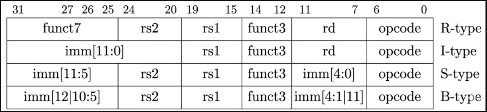
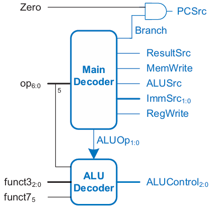
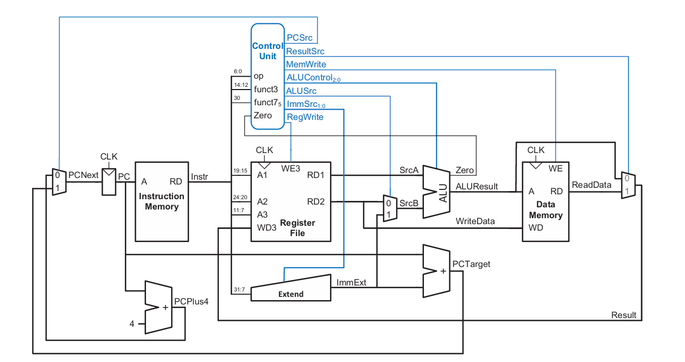
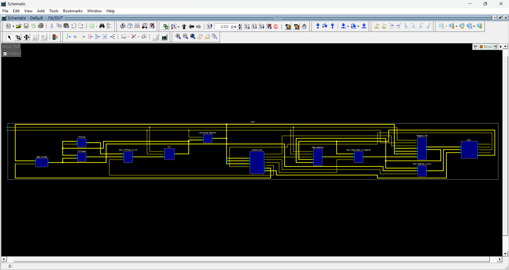
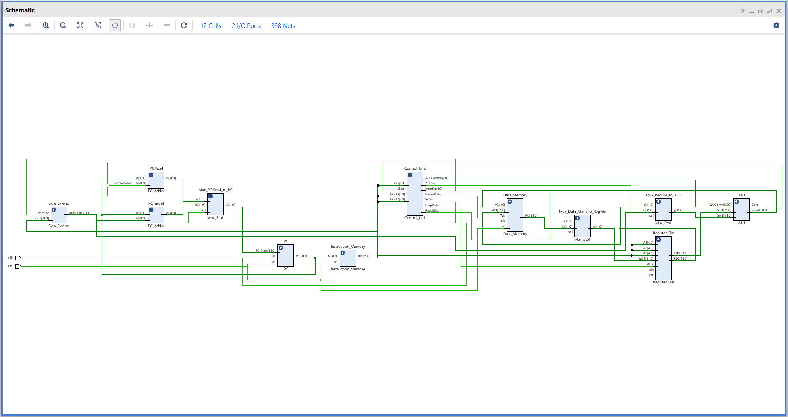
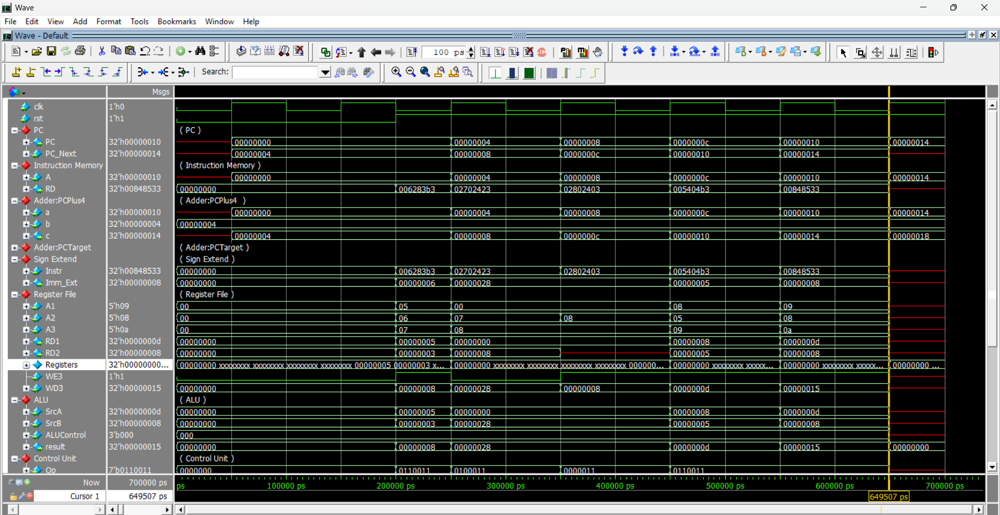
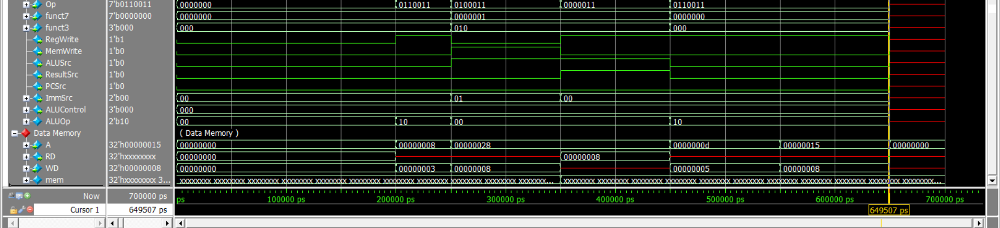
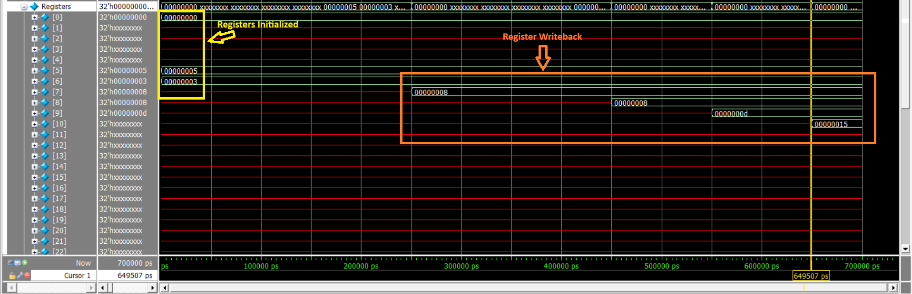
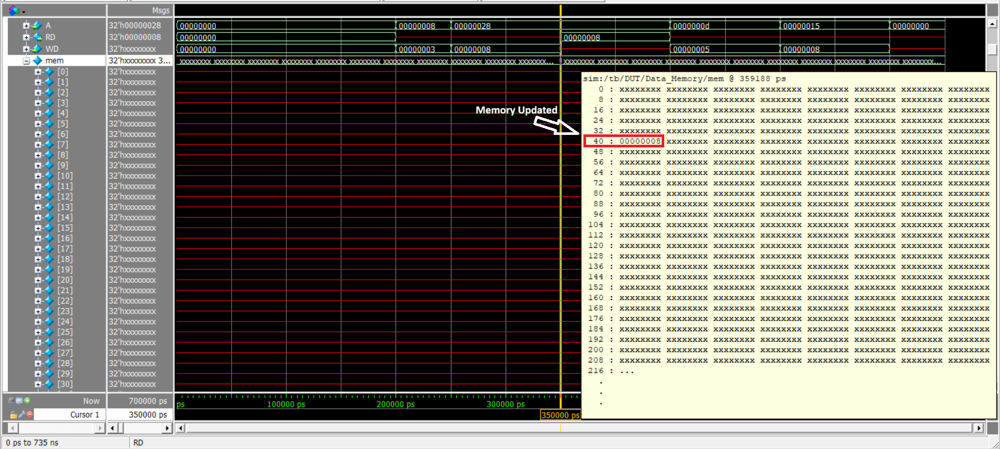

# RISCV Single Cycle Core Implementation

This project showcases the design and implementation of a RISC-V Single Cycle Core processor using Verilog HDL. The RTL was synthesized to view schematics using Vivado 2025.1 and simulation was performed using Siemens QuestaSim 10.7c.

It is based on the RV32I Base Integer Instruction Set Architecture. In a Single-cycle Microarchitecure, the processor executes a complete instruction in one clock cycle.The time period of this clock cycle is determined by the slowest instruction which has the longest datapath and this limits the maximum clock frequency.

-----------------------------------------------------------

## Architecture & Features

- ISA Supported: RV32I (Base 32-bit Integer)
- Word Size: 32 bits
- Memory Architecture: **Harvard Architecture** (Separate Instruction and Data memories)
- Register File: 32 x 32-bit general-purpose registers (Register x0 is hardwired to zero).

-------------------------------------------------------------

## Instructions Supported 

The single-cycle core processor supports 4 types of RISCV Instruction formats: 
- R-Type (Register-Register): add, sub, and, or
- I-Type (Register-Immediate): lw(Load Word), it does not support any I-type ALU instructions like addi, andi, ori as of now.
- S-Type (Store): sw(Store Word)
- B-Type (Branch) : beq 

----------------------------------------------------------------

## Datapath Components:

The processor consists of the following primary hardware modules:

1. Program Counter (PC): Holds the memory address of the current instruction. It sequentially updates to PC + 4 or branches to a new target address.

2. Instruction Memory (IMEM): Read-only memory that takes the PC address and outputs the 32-bit instruction.The 32-bit instructions can be decoded/broken for various of types as follows:



3. Register File: A memory block containing the 32 architectural registers. It has two read ports (for source operands rs1 and rs2) and one write port (for destination register rd).

4. Immediate Generator (ImmGen): Extracts and sign-extends the immediate values from various instruction formats (I, S, B) into a 32-bit value.

5. ALU (Arithmetic Logic Unit): Performs arithmetic and bitwise operations. It evaluates branch conditions and computes memory addresses for load/store instructions.

6. Data Memory (DMEM): Read/write memory used for lw and sw instructions respectively.

7. Control Unit: It acts as the brain of the processor. It decodes the opcode, funct3, and funct7 fields of the instruction to generate the required control signals. It consists of two components - Main Decoder and ALU Decoder.

<div align="center">
  
</div><br>

Main Decoder and ALU Decoder work according to the following truth tables respectively :

### Main Decoder Truth Table

| Instruction | Op | RegWrite | ImmSrc | ALUSrc | MemWrite | ResultSrc | Branch | ALUOp |
| :--- | :--- | :---: | :---: | :---: | :---: | :---: | :---: | :---: |
| `lw` | 0000011 | 1 | 00 | 1 | 0 | 1 | 0 | 00 |
| `sw` | 0100011 | 0 | 01 | 1 | 1 | x | 0 | 00 |
| `R-type` | 0110011 | 1 | xx | 0 | 0 | 0 | 0 | 10 |
| `beq` | 1100011 | 0 | 10 | 0 | 0 | x | 1 | 01 |

### ALU Decoder Truth Table

| ALUOp | funct3 | {op5, funct7_5} | ALUControl | Instruction |
| :---: | :---: | :---: | :--- | :--- |
| 00 | x | x | 000 (add) | `lw`, `sw` |
| 01 | x | x | 001 (subtract) | `beq` |
| 10 | 000 | 00, 01, 10 | 000 (add) | `add` |
| 10 | 000 | 11 | 001 (subtract) | `sub` |
| 10 | 010 | x | 101 (set less than) | `slt` |
| 10 | 110 | x | 011 (or) | `or` |
| 10 | 111 | x | 010 (and) | `and` |
   
--------------------------------------------------------------  
  
## Instruction Execution Flow

In single-cycle core , every instruction goes through the following phases and all of them happen in a single clock cycle regardless of how slow the instruction is **(or how long its datapath is.)**.The clock period has to be decided in such a way that all these 5 phases can fit inside one clock cycle window.

1.**Instruction Fetch (IF):** The PC value points to the Instruction Memory, fetching the 32-bit instruction.

2.**Instruction Decode (ID):** The Control Unit decodes the instruction. The Register File reads the source registers (rs1, rs2), and the ImmGen sign-extends any immediate values.

3.**Execute (EX):** The ALU performs the requested operation (addition, bitwise logic, memory address calculation) using the register data or the immediate value.

4.**Memory Access (MEM):** If the instruction is a load (lw) or store (sw), the core accesses the Data Memory using the address calculated by the ALU.

5.**Write Back (WB):** The final result—either from the ALU or the Data Memory—is written back to the destination register (rd) in the Register File.

-------------------------------------------------------

### Complete Single-Cycle processor 



--------------------------------------

### Sample Instruction Code

The following set of instructions have been simulated in single-cycle core :

```asm
00500293 // addi x5, x0, 0x5
00300313 // addi x6, x0, 0x3
006283B3 // add x7, x5, x6 
02702423 // sw x7, 40(x0) 
02802403 // lw x8, 40(x0) 
005404B3 // add x9, x8, x5 
00848533 // add x10, x9, x8
```
<br>

**NOTE:** 
- The first two instructions of ADDI are not supported by our design so we have to manually declare these values of 5 and 3 inside the Registers[5] and Registers[6] of the Register File respectively as we are using the values of these two registers in the further instructions.
- We have also hardcoded the 0th Register with the value 0 as per the RISCV specifications.

----------------------------------------------------------------

<details><summary><b>Schematic</b></summary><br>

The schematic has been generated using both Questasim 10.7c and Vivado 2025.1

- **Questasim 10.7c**



- **Vivado 2025.1**



</details>

-----------------------------------------------------

<details><summary><b>Simulation</b></summary><br>

The simulation has been performed using Questasim 10.7c.






</details>

--------------------------------------------------

## Simulation Steps

To compile the RTL and simulate the design , run the `run.do` file in QuestaSim. 

----------------------------------------------------

## References & Acknowledgments

This project was built with reference to the following materials:

S. L. Harris and D. M. Harris, *Digital Design and Computer Architecture: RISC-V Edition*. Morgan Kaufmann, 2022.